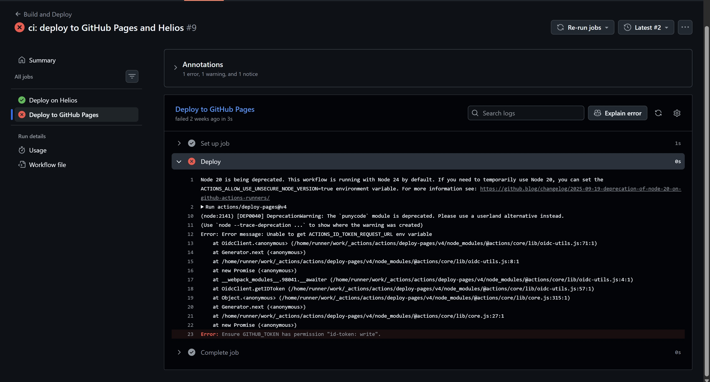
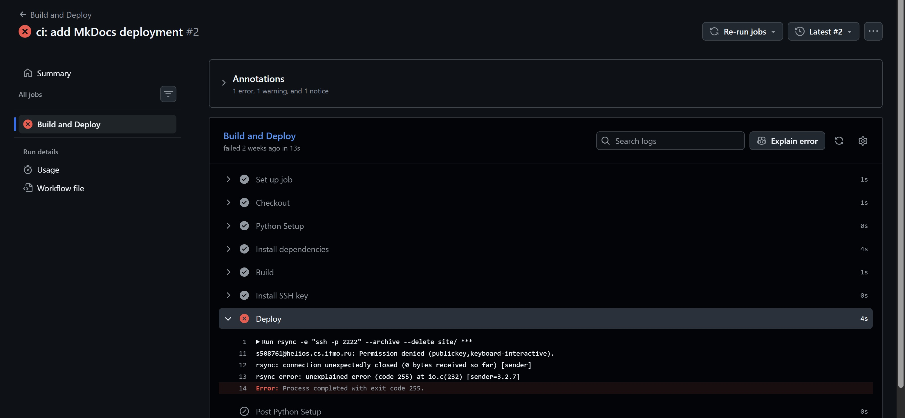

## Ссылки

| Ресурс             | Ссылка                                 |
| ------------------ | -------------------------------------- |
| GitHub репозиторий | <https://github.com/gr33b0k/pyweb_t1/> |
| GitHub Pages       | <https://gr33b0k.github.io/pyweb_t1/>  |
| Helios             | <https://se.ifmo.ru/~s508761/mkdocs/>  |

### 1, 2, 3. Подготовка окружения

Для выполнения работы были установлены необходимые инструменты для создания, сборки и публикации статического сайта.

| Инструмент  | Назначение                          |
| ----------- | ----------------------------------- |
| Python 3.14 | Среда выполнения                    |
| `venv`      | Изолированное виртуальное окружение |

Виртуальное окружение создавалось встроенным средством Python:

```bash
python -m venv venv
```

Отдельная установка `virtualenv` не потребовалась. После создания окружение было активировано, после чего были установлены зависимости проекта.

### 4. Фиксация зависимостей и настройка `.gitignore`

Для фиксации зависимостей проекта был создан файл `requirements.txt`. В него были записаны используемые пакеты с конкретными версиями.

| Пакет             | Версия | Назначение                   |
| ----------------- | -----: | ---------------------------- |
| `mkdocs`          |  1.6.1 | Генерация статического сайта |
| `Markdown`        | 3.10.3 | Обработка Markdown-разметки  |
| `Jinja2`          |  3.1.6 | Работа с шаблонами           |
| `mkdocs-material` |  9.7.7 | Оформление сайта             |

Также был создан файл `.gitignore`. В него добавлены виртуальное окружение `venv/`, каталог `site/`, создаваемый при сборке MkDocs, а также служебные файлы и кэш.

### 5. Установка MkDocs и создание сайта

В проект был установлен MkDocs и создан каркас статического сайта.

Основная конфигурация была вынесена в файл `mkdocs.yml`. В нем были заданы название сайта, автор, навигация, ссылка на репозиторий и тема оформления Material.

В качестве структуры сайта были созданы главная страница и отдельный раздел с отчетом.

Для проверки доставки сайта в содержимое страницы была добавлена контрольная строка:

```text
MKDOCS_DEPLOY_TEST_2026
```

Она впоследствии используется автоматическим healthcheck после публикации.

### 6. Локальная сборка и проверка

Перед настройкой автоматической публикации сайт был проверен локально.

Для запуска локального сервера использовалась команда:

```bash
mkdocs serve
```

Для получения готового статического сайта:

```bash
mkdocs build --strict
```

Результатом сборки является каталог `site/`, содержащий готовые HTML-страницы, изображения, стили, JavaScript-файлы и другие ресурсы.

Параметр `--strict` был выбран для CI/CD. В этом режиме предупреждения MkDocs рассматриваются как ошибки, поэтому workflow не продолжает публикацию некорректно собранного сайта.

### 7. Размещение проекта в GitHub

После проверки локальной сборки проект был размещен в GitHub-репозитории:

<https://github.com/gr33b0k/pyweb_t1/>

Для проекта была настроена основная ветка `main`, а также отдельная ветка `preview`, используемая для проверки изменений до их публикации в основной версии.

### 8. Настройка GitHub Actions и GitHub Pages

Для автоматизации процесса был создан workflow GitHub Actions.

Для GitHub Pages была использована официальная схема:

```text
actions/upload-pages-artifact
        ↓
actions/deploy-pages
```

В настройках репозитория в разделе **Pages** источником публикации был выбран **GitHub Actions**.

Workflow для основной ветки выполняет следующие действия:

1. получает исходный код репозитория;
2. устанавливает Python 3.13;
3. устанавливает зависимости из `requirements.txt`;
4. выполняет `mkdocs build --strict`;
5. загружает каталог `site/` как artifact;
6. публикует artifact через GitHub Pages.

При первоначальной настройке GitHub Pages возникла ошибка:

```text
Error: Unable to get ACTIONS_ID_TOKEN_REQUEST_URL env variable
```

В сообщении GitHub Actions также указывалось:

```text
Ensure GITHUB_TOKEN has permission "id-token: write".
```

Причиной оказалось отсутствие необходимого разрешения для получения OIDC-токена, используемого `actions/deploy-pages`.

Для исправления в workflow были добавлены разрешения:

```yaml
permissions:
  contents: read
  pages: write
  id-token: write
```

После этого публикация через `actions/deploy-pages` стала выполняться корректно.

### 9. Подготовка и настройка Helios

После настройки GitHub Pages была реализована вторая схема публикации — на сервер Helios ИТМО.

Для подключения к серверу использовался SSH. В GitHub Actions были добавлены секреты:

| Секрет            | Назначение                         |
| ----------------- | ---------------------------------- |
| `PRIVATE_SSH_KEY` | Приватный ключ для SSH-подключения |
| `KNOWN_HOSTS`     | Доверенный ключ сервера            |
| `REMOTE_DEST`     | Путь к каталогу публикации         |
| `HELIOS_URL`      | Публичный адрес сайта              |

В workflow приватный ключ записывается в файл:

```text
~/.ssh/id_ed25519
```

а `KNOWN_HOSTS` — в:

```text
~/.ssh/known_hosts
```

После этого GitHub Actions может устанавливать SSH-соединение с Helios без ручного ввода пароля.

Для передачи файлов используется `rsync` через SSH-порт `2222`:

```bash
rsync \
  -e "ssh -p 2222" \
  --archive \
  --delete \
  site/ \
  "$REMOTE_PATH"
```

Параметр `--archive` сохраняет структуру и атрибуты файлов, а `--delete` удаляет на сервере файлы, которых больше нет в новой сборке.

При настройке SSH также возникла ошибка доступа. На одном из этапов был использован некорректный SSH-ключ: ключ, находившийся на сервере, не соответствовал приватному ключу, используемому GitHub Actions.

В результате подключение завершалось ошибкой:

```text
Permission denied (publickey)
```

Для проверки была выполнена повторная настройка пары SSH-ключей: публичный ключ был установлен на Helios, а соответствующий приватный ключ сохранен в секрете `PRIVATE_SSH_KEY` GitHub Actions. После замены ключей SSH-подключение и передача файлов стали выполняться успешно.

### 10. Настройка автоматического развертывания на Helios

Для Helios в workflow был создан отдельный job `deploy-helios`.

Сначала определяется текущая ветка. Для `main` используются основной URL и основной каталог публикации:

```text
REMOTE_DEST
```

Для остальных веток автоматически формируется отдельный путь.

Например, для ветки `preview`:

```text
REMOTE_DEST/preview/preview/
```

Таким образом, основная версия и версии отдельных веток не смешиваются.

Перед передачей файлов workflow выполняет сборку MkDocs, устанавливает SSH-ключ и создает необходимый каталог preview:

```bash
ssh -p 2222 "$REMOTE_HOST" \
  "mkdir -p '${REMOTE_PATH}/preview/${BRANCH_NAME}'"
```

После этого `rsync` передает содержимое `site/` на сервер.

При первоначальной настройке этого шага возникла ошибка:

```text
rsync: [Receiver] mkdir ".../preview/preview" failed:
No such file or directory (2)
```

Причиной было отсутствие промежуточного каталога `preview` на Helios. Сам `rsync` не смог создать необходимую вложенную структуру каталогов.

Проблема была устранена добавлением отдельного шага `Create preview directory`, который перед развертыванием выполняет `mkdir -p`. После этого каталог создается автоматически, и ручное создание директорий на сервере больше не требуется.

### 11. Настройка URL сайта

В `mkdocs.yml` используется:

```yaml
site_url: !ENV [SITE_URL, https://localhost:8000]
```

Это позволяет задавать адрес сайта непосредственно при сборке.

Для GitHub Pages:

```text
https://gr33b0k.github.io/pyweb_t1/
```

Для основной версии Helios используется значение `HELIOS_URL`.

Для preview-ветки URL формируется автоматически:

```text
HELIOS_URL/preview/<branch>/
```

Также включена настройка:

```yaml
use_directory_urls: true
```

При настройке preview несколько раз возникали проблемы со слешами в формируемых путях и URL. В частности, первоначальная конфигурация приводила к неправильному формированию адреса preview. Проблема была устранена приведением формирования `SITE_URL` и `REMOTE_PATH` к единому виду.

### 12. Проверка результата развертывания

После передачи файлов на Helios выполняется автоматический healthcheck.

Он получает URL из переменной `SITE_URL` и выполняет HTTP-запрос:

```bash
HTTP_CODE=$(curl \
  -L \
  -s \
  -o response.html \
  -w "%{http_code}" \
  "$SITE_URL")
```

После этого проверяются два условия:

1. сервер должен вернуть HTTP `200`;
2. полученный HTML должен содержать контрольную строку:

```text
MKDOCS_DEPLOY_TEST_2026
```

Если хотя бы одно условие не выполняется, workflow завершается с ошибкой.

В процессе настройки была обнаружена еще одна проблема: первоначально healthcheck всегда проверял значение `HELIOS_URL`, даже при публикации preview-ветки. В результате workflow мог успешно развернуть preview-версию, но проверять при этом основную страницу.

Для устранения ошибки healthcheck был переведен на использование переменной `SITE_URL`, которая рассчитывается на этапе `Configure deployment` отдельно для каждой ветки.

### 13. Лицензии

Для опубликованных материалов были добавлены следующие лицензии:

| Лицензия  | Объект  |
| --------- | ------- |
| MIT       | Код     |
| CC BY 4.0 | Контент |

### 14. Отладка

В процессе разработки и настройки было обнаружено несколько ошибок. Для каждой ошибки была сформулирована гипотеза о причине, после чего причина проверялась непосредственно в процессе выполнения workflow.

#### Ошибка 1. GitHub Pages не получил OIDC-токен



**Текст ошибки:**

```text
Error: Unable to get ACTIONS_ID_TOKEN_REQUEST_URL env variable
```

Дополнительно GitHub Actions сообщал:

```text
Ensure GITHUB_TOKEN has permission "id-token: write".
```

**Гипотеза:**  
Для workflow не выданы необходимые права GitHub Actions на получение OIDC-токена, который используется при публикации через `actions/deploy-pages`.

**Проверка:**  
Был проверен блок `permissions` в workflow. Разрешения `id-token: write` действительно не было.

**Решение:**  
В workflow были добавлены необходимые разрешения:

```yaml
permissions:
  contents: read
  pages: write
  id-token: write
```

После повторного запуска workflow публикация через GitHub Pages выполнилась успешно.

---

#### Ошибка 2. SSH не подключается к Helios



**Текст ошибки:**

```text
Permission denied (publickey)
```

**Гипотеза:**  
Приватный SSH-ключ, сохраненный в секрете `PRIVATE_SSH_KEY`, не соответствует публичному ключу, установленному на Helios.

**Проверка:**  
Была проверена используемая SSH-пара: публичный ключ на сервере и приватный ключ, передаваемый GitHub Actions. Обнаружено несоответствие ключей.

**Решение:**  
Была создана корректная пара SSH-ключей. Публичный ключ установлен на Helios, а соответствующий приватный ключ сохранен в GitHub Secret `PRIVATE_SSH_KEY`.

После этого GitHub Actions смог установить SSH-соединение с сервером.

---

#### Ошибка 3. `rsync` не может создать каталог preview


**Текст ошибки:**

```text
rsync: [Receiver] mkdir ".../preview/preview" failed:
No such file or directory (2)
rsync error: error in file IO (code 11)
```

**Гипотеза:**  
На сервере отсутствует один из родительских каталогов, необходимых для размещения preview-версии.

**Проверка:**  
На Helios была проверена структура каталога публикации. Каталог `preview` отсутствовал, поэтому `rsync` не мог создать вложенный путь `preview/preview`.

**Решение:**  
Перед выполнением `rsync` в workflow был добавлен отдельный шаг:

```bash
ssh -p 2222 "$REMOTE_HOST" \
  "mkdir -p '${REMOTE_PATH}/preview/${BRANCH_NAME}'"
```

Команда `mkdir -p` создает всю необходимую структуру каталогов. После этого передача файлов выполняется успешно.

---

#### Ошибка 4. Неправильно формируется URL preview-версии

**Ошибка:**

При открытии preview-версии использовался некорректно сформированный адрес, поскольку при сборке URL между адресом Helios и каталогом `preview` отсутствовал необходимый `/`.

**Гипотеза:**  
Ошибка возникает при конкатенации `HELIOS_URL/REMOTE_DEST` и пути preview в workflow.

**Проверка:**  
Было проверено значение переменной `SITE_URL`, формируемое на этапе `Configure deployment`. При сравнении полученного значения с фактическим расположением файлов на сервере обнаружилось несоответствие.

**Решение:**  
Формирование URL было приведено к виду:

```bash
SITE_URL=${HELIOS_URL}/preview/${BRANCH_NAME}/
```

В результате URL preview-версии соответствует фактическому каталогу публикации.

---

Таким образом, в ходе работы были исправлены ошибки, связанные с правами GitHub Actions, SSH-аутентификацией, созданием каталогов на Helios и формированием URL. Для каждой ошибки сначала определялась возможная причина, затем она проверялась, после чего вносилось конкретное исправление в конфигурацию или workflow.

### Итог

В результате был настроен автоматический цикл сборки и публикации статического сайта сразу на двух площадках: GitHub Pages и Helios. Для Helios дополнительно реализованы публикация preview-веток, автоматическое создание каталогов, проверка доступности опубликованного сайта и резервное копирование предыдущей версии.
